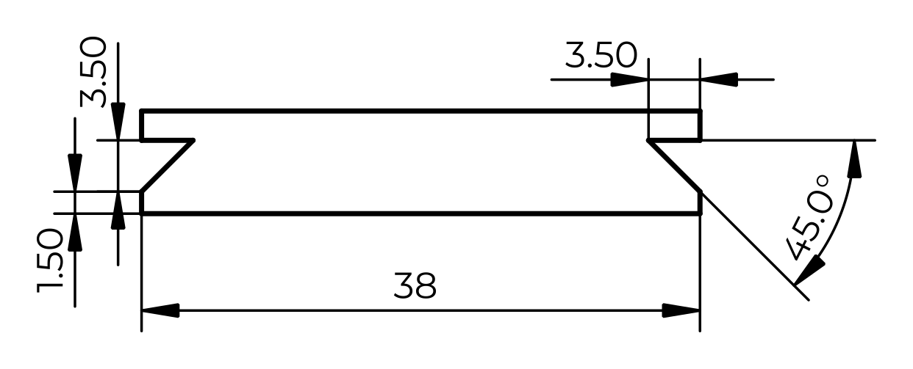

# Arca-Swiss Quick Release



The standard dovetail plate system for high-end tripod heads and camera accessories.

## Dovetail Dimensions

| Dimension | Value | Notes |
|-----------|-------|-------|
| Dovetail width | 38.0 mm | Bottom width (widest point) |
| Dovetail angle | 45° | Both sides |
| Dovetail height | 10.0 mm | Vertical distance of angled faces |
| Top width | 18.0 mm | Calculated: 38 - 2×10 |
| Plate thickness | 10-15 mm | Varies by model |
| Total height | 15-16 mm | Including base |

**Note:** 38mm is the original Arca-Swiss standard. Some third-party plates vary 37-39mm. Plates >39mm may not fit some clamps.

### Compact "Monoball®Fix" System
Arca-Swiss also offers a 26mm wide dovetail for mirrorless cameras.

## Safety Features

- **End stops**: M3 screws or machined bumps at plate ends prevent sliding out
- **Anti-twist ridge**: Some plates have a center ridge (2-3mm wide)

## Clamp Compatibility

| Clamp Opening | Compatibility |
|---------------|---------------|
| 38-40 mm | Standard |
| 35-38 mm | May be tight |
| 40+ mm | Loose, needs safety screws |

## OpenSCAD Module

```openscad
// Arca-Swiss compatible dovetail plate
module arca_plate(length=50, height=10, base=5) {
    width_bottom = 38;
    angle = 45;
    // At 45°, each side moves inward by height
    width_top = width_bottom - 2 * height;
    
    linear_extrude(length) {
        polygon([
            [-width_bottom/2, 0], 
            [width_bottom/2, 0],
            [width_top/2, height], 
            [-width_top/2, height]
        ]);
    }
    
    // Optional base plate
    if (base > 0) {
        translate([-width_bottom/2, height, 0])
            cube([width_bottom, base, length]);
    }
}

// Clamp pocket (negative space)
module arca_clamp_pocket(length=60, depth=12, clearance=0.3) {
    width = 38 + clearance;
    angle = 45;
    width_top = width - 2 * depth;
    
    linear_extrude(length)
        polygon([
            [-width/2, -0.1], 
            [width/2, -0.1],
            [width_top/2, depth], 
            [-width_top/2, depth]
        ]);
}
```

## Print Orientation

- **Best**: Dovetail cross-section on the print bed (Z is plate length)
- **Material**: PLA for rigidity, PETG for smooth sliding

## Source
- Arca-Swiss USA official specifications
- Community measurements

